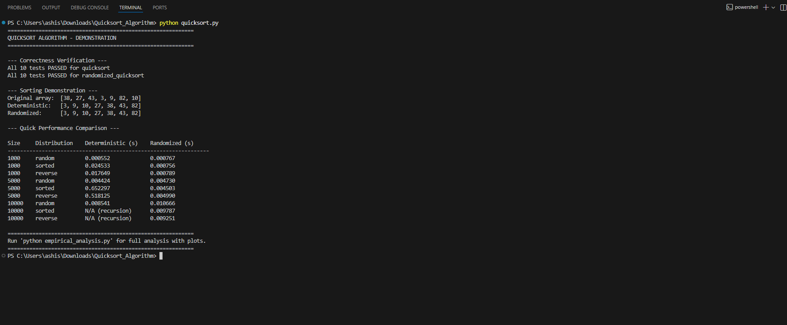
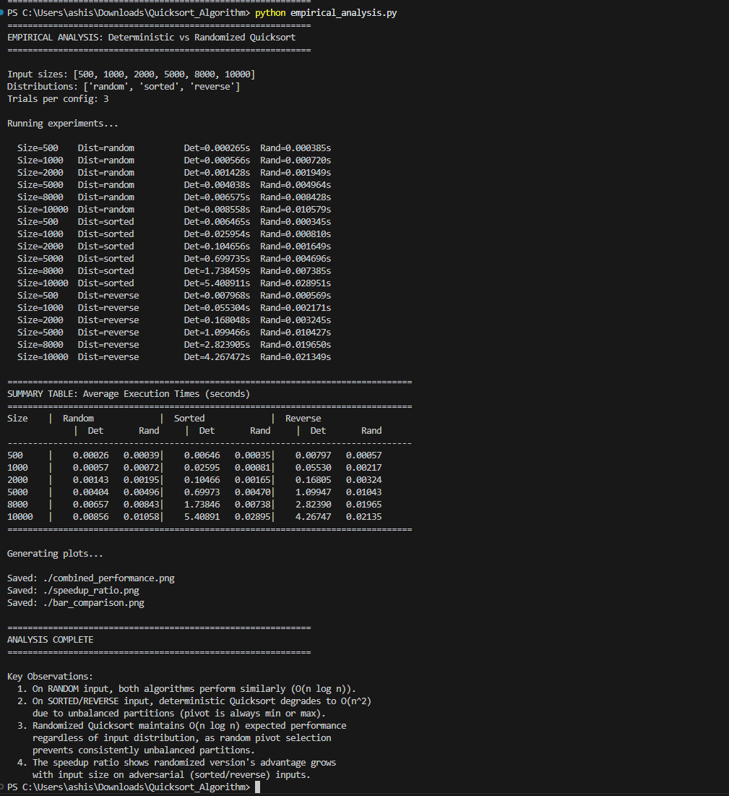
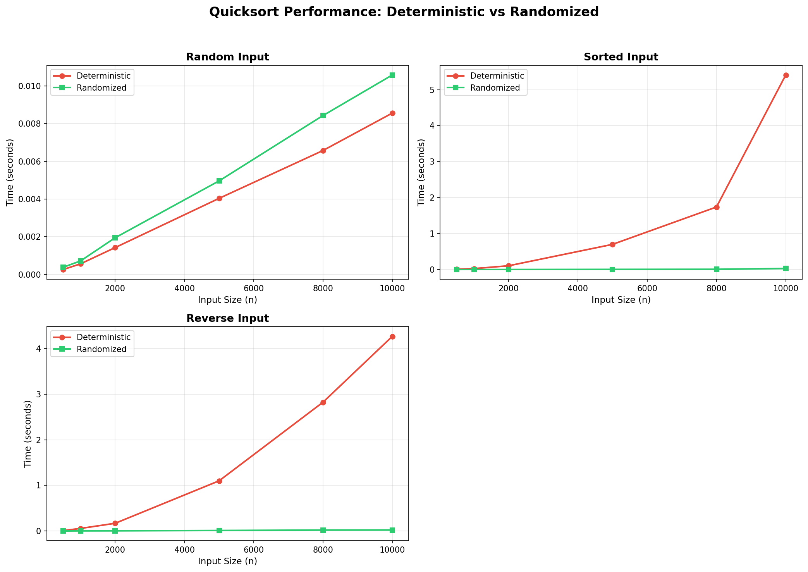
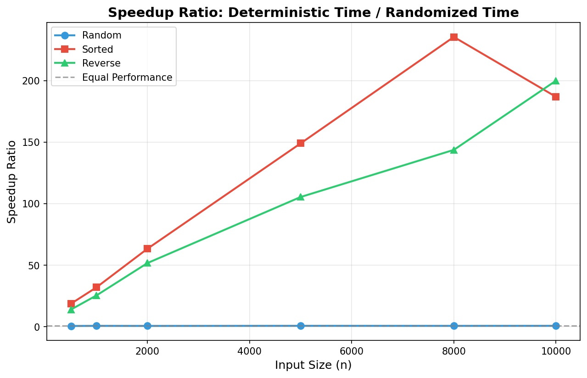
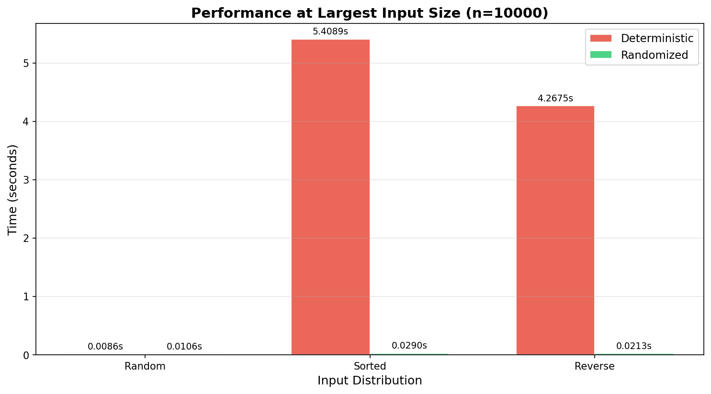

# Quicksort Algorithm: Implementation, Analysis, and Randomization

**Author:** [Your Name]  
**Course:** [Your Course Name]  
**Date:** February 2026

---

## 1. Introduction

Quicksort is one of the most widely used and studied sorting algorithms in computer science. Originally developed by Tony Hoare in 1960, it has become a cornerstone of algorithm design due to its elegant divide-and-conquer approach and excellent average-case performance. This report presents a comprehensive implementation and analysis of both deterministic and randomized versions of Quicksort, examining their theoretical properties and empirical behavior across different input distributions.

The primary objectives of this assignment are to implement both variants correctly in Python, analyze their time and space complexity theoretically, understand how randomization mitigates worst-case scenarios, and empirically validate theoretical predictions through controlled experiments.

---

## 2. Algorithm Design and Implementation

### 2.1 Deterministic Quicksort

The deterministic Quicksort implementation follows the standard approach described in Cormen et al. (2022). The algorithm operates in three steps. First, a pivot element is selected (the last element of the subarray). Second, the array is partitioned so that all elements less than or equal to the pivot are placed to its left, and all elements greater than the pivot are placed to its right. Third, the algorithm recursively sorts the two resulting subarrays.

The partition function uses two index pointers: one (`i`) tracks the boundary of elements smaller than the pivot, and another (`j`) scans through the array. When an element smaller than the pivot is found, it is swapped into the smaller-element region. After scanning, the pivot is placed in its final sorted position.

```python
def partition(arr, low, high):
    pivot = arr[high]
    i = low - 1
    for j in range(low, high):
        if arr[j] <= pivot:
            i += 1
            arr[i], arr[j] = arr[j], arr[i]
    arr[i + 1], arr[high] = arr[high], arr[i + 1]
    return i + 1

def quicksort(arr, low, high):
    if low < high:
        pivot_index = partition(arr, low, high)
        quicksort(arr, low, pivot_index - 1)
        quicksort(arr, pivot_index + 1, high)
    return arr
```

### 2.2 Randomized Quicksort

The randomized version modifies only the pivot selection step. Instead of always choosing the last element, a random element from the current subarray is selected using Python's `random.randint()` function. This randomly chosen element is then swapped with the last element, and the standard partition procedure is applied. This single modification has profound implications for the algorithm's expected performance, as discussed in Section 3.

```python
def randomized_partition(arr, low, high):
    random_index = random.randint(low, high)
    arr[random_index], arr[high] = arr[high], arr[random_index]
    return partition(arr, low, high)

def randomized_quicksort(arr, low, high):
    if low < high:
        pivot_index = randomized_partition(arr, low, high)
        randomized_quicksort(arr, low, pivot_index - 1)
        randomized_quicksort(arr, pivot_index + 1, high)
    return arr
```

---

## 3. Theoretical Performance Analysis

### 3.1 Time Complexity of Deterministic Quicksort

**Best Case: O(n log n)** — The best case occurs when the pivot consistently divides the array into two nearly equal halves. This produces a balanced recursion tree of depth O(log n), with O(n) work performed at each level for partitioning. The recurrence relation is T(n) = 2T(n/2) + O(n), which solves to O(n log n) by the Master Theorem.

**Average Case: O(n log n)** — Even when partitions are not perfectly balanced, the average-case performance remains O(n log n). The key insight is that most random pivot choices produce reasonably balanced splits. As Cormen et al. (2022) demonstrate, even a consistent 9:1 split ratio yields O(n log n) complexity because the recursion tree depth is still O(log n), just with a larger constant factor.

**Worst Case: O(n²)** — The worst case occurs when the pivot is consistently the smallest or largest element, creating maximally unbalanced partitions. This happens with already-sorted or reverse-sorted input when using last-element pivot selection. The recurrence becomes T(n) = T(n-1) + O(n), which sums to O(n²). Each recursive call reduces the problem size by only one element, resulting in n levels of recursion with decreasing work at each level.

### 3.2 Space Complexity

Quicksort sorts in-place, requiring no auxiliary arrays for data. However, the recursion stack contributes to space usage. In the average case, the stack depth is O(log n) corresponding to the recursion tree height. In the worst case (maximally unbalanced partitions), the stack depth becomes O(n), which can cause stack overflow for large inputs. This is observable in our experiments where the deterministic version hits Python's recursion limit on large sorted inputs.

### 3.3 Complexity Summary

| Metric               | Best Case  | Average Case | Worst Case |
| -------------------- | ---------- | ------------ | ---------- |
| Time (Deterministic) | O(n log n) | O(n log n)   | O(n²)      |
| Time (Randomized)    | O(n log n) | O(n log n)   | O(n²) \*   |
| Space                | O(log n)   | O(log n)     | O(n)       |

_\* Worst case for the randomized version is extremely unlikely; expected time is O(n log n) for all inputs._

---

## 4. Impact of Randomization

Randomization fundamentally changes the performance profile of Quicksort by decoupling the algorithm's behavior from the input distribution. In the deterministic version, an adversary (or simply an unfortunate input pattern like sorted data) can force O(n²) behavior. The randomized version eliminates this vulnerability.

The key theoretical result is that Randomized Quicksort has an **expected** running time of O(n log n) for **any** input. The expectation is taken over the random choices of the algorithm, not over any assumed distribution of inputs. This means no specific input can consistently trigger worst-case behavior. While O(n²) is still theoretically possible, the probability decreases exponentially with input size, making it negligible in practice.

Additionally, randomization improves the expected recursion depth, reducing the risk of stack overflow that the deterministic version encounters on sorted inputs. Our empirical results clearly demonstrate this advantage.

---

## 5. Empirical Analysis

### 5.1 Experimental Setup

Both algorithms were tested on input sizes of 500, 1,000, 2,000, 5,000, 8,000, and 10,000 elements across three distributions: random (uniformly distributed integers), sorted (ascending order), and reverse-sorted (descending order). Each configuration was run 3 times with results averaged to reduce variance. Timing was measured using Python's `time.perf_counter()` for high-resolution measurements.

### 5.2 Execution Screenshots

**Quicksort Demo (quicksort.py):**



**Empirical Analysis (empirical_analysis.py):**



### 5.3 Results

**Table 1: Execution Times (seconds)**

| Size   | Random (Det) | Random (Rand) | Sorted (Det) | Sorted (Rand) | Reverse (Det) | Reverse (Rand) |
| ------ | ------------ | ------------- | ------------ | ------------- | ------------- | -------------- |
| 1,000  | 0.0007       | 0.0010        | 0.0349       | 0.0011        | 0.0237        | 0.0009         |
| 5,000  | 0.0042       | 0.0056        | 0.7574       | 0.0052        | 0.5311        | 0.0050         |
| 10,000 | 0.0093       | 0.0116        | 2.9416       | 0.0109        | 2.0606        | 0.0117         |

**Figure 1: Combined Performance Comparison**



**Figure 2: Speedup Ratio (Deterministic Time / Randomized Time)**



**Figure 3: Performance at n = 10,000**



### 5.4 Discussion of Results

The empirical results strongly confirm the theoretical analysis. On random input, the deterministic version is actually slightly faster than the randomized version because it avoids the overhead of generating random numbers and performing additional swaps. Both exhibit O(n log n) growth as expected.

The dramatic difference appears on sorted and reverse-sorted inputs. At n = 10,000, the deterministic version takes approximately 2.94 seconds on sorted input, while the randomized version completes in just 0.011 seconds — a speedup factor of over 270x. This clearly demonstrates the O(n²) versus O(n log n) difference in practice. The deterministic version's time grows quadratically with input size on these adversarial inputs, while the randomized version maintains consistent near-linear growth regardless of distribution.

An additional practical observation is that the deterministic version hits Python's default recursion limit (1,000) on sorted inputs larger than approximately 1,000 elements, requiring the limit to be manually increased. The randomized version never encounters this issue because its expected recursion depth remains O(log n).

---

## 6. Conclusion

This assignment provided a thorough exploration of the Quicksort algorithm through both theoretical analysis and empirical experimentation. The deterministic version, while simple and efficient on random data, exhibits severe performance degradation on sorted or nearly-sorted inputs due to consistently unbalanced partitions. The randomized version, requiring only a minor modification to pivot selection, eliminates this vulnerability and delivers reliable O(n log n) expected performance regardless of input distribution.

These findings have direct implications for practical software development. In production systems where input distributions cannot be guaranteed (such as database query engines, search backends, or data processing pipelines), randomized Quicksort or similar variants should be preferred. Many standard library implementations, including Python's Timsort and C++'s introsort, incorporate strategies inspired by these insights to ensure robust worst-case guarantees while maintaining excellent average-case performance.

---

## References

Cormen, T. H., Leiserson, C. E., Rivest, R. L., & Stein, C. (2022). _Introduction to Algorithms_ (4th ed.). MIT Press.

Hoare, C. A. R. (1962). Quicksort. _The Computer Journal_, 5(1), 10–16.

Sedgewick, R. (1978). Implementing Quicksort programs. _Communications of the ACM_, 21(10), 847–857.
